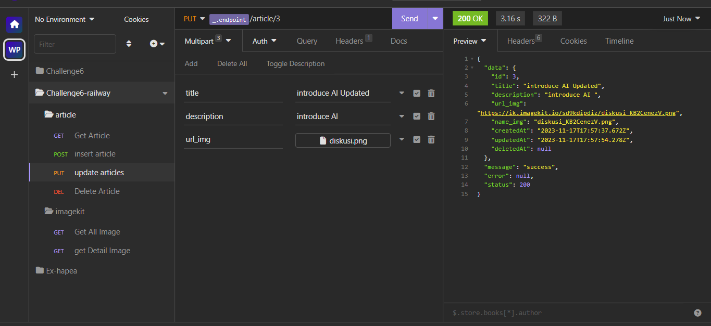
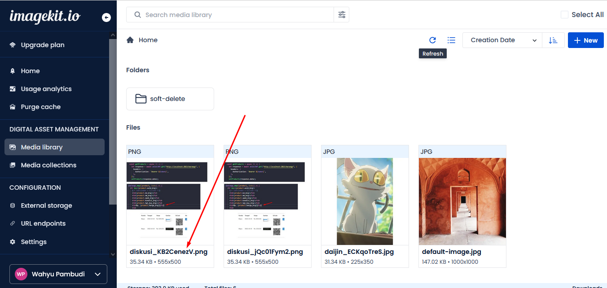

# binar-backend-challenge-6
Backend media handling - Cloud &amp; server management - Deployment


#### Alamat Server Backend REST API [https://binar-backend-challenge-6-production.up.railway.app/article/](https://binar-backend-challenge-6-production.up.railway.app/article/)
* HTTP Response Client (Insomnia, Postman, RESTer (firefox add-ons)

### Get Article
[https://binar-backend-challenge-6-production.up.railway.app/article/](https://binar-backend-challenge-6-production.up.railway.app/article/)


### Insert Article
[https://binar-backend-challenge-6-production.up.railway.app/article/](https://binar-backend-challenge-6-production.up.railway.app/article/)


### Update Article
[https://binar-backend-challenge-6-production.up.railway.app/article/id](https://binar-backend-challenge-6-production.up.railway.app/article/)



### Delete Article
[https://binar-backend-challenge-6-production.up.railway.app/article/id](https://binar-backend-challenge-6-production.up.railway.app/article/)



### Get All Image

{{ _.endpoint }}/article/picture/4 ```(4 adalah limit get data gambar)```
[https://binar-backend-challenge-6-production.up.railway.app/article/picture/4](https://binar-backend-challenge-6-production.up.railway.app/article/)


### Get Detail Image
{{ _.endpoint }}/article/pict/id

[https://binar-backend-challenge-6-production.up.railway.app/article/pict/id](https://binar-backend-challenge-6-production.up.railway.app/article/)


